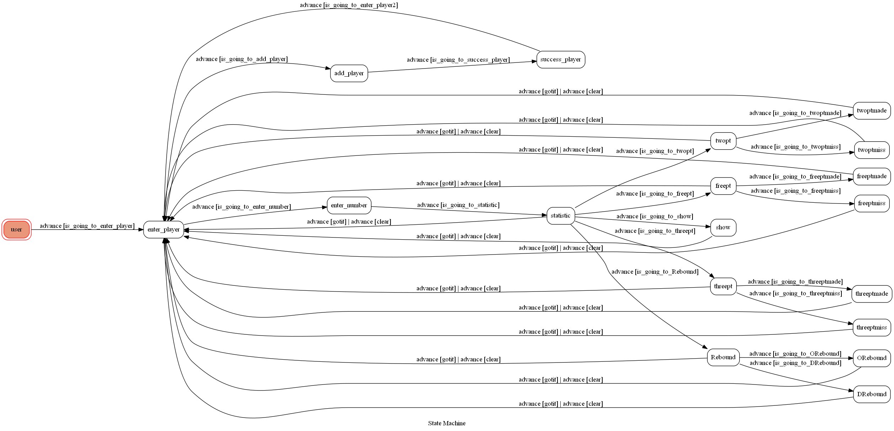

# TOC Project 2020

[](https://codeclimate.com/github/NCKU-CCS/TOC-Project-2020/maintainability)

[](https://snyk.io/test/github/NCKU-CCS/TOC-Project-2020)


Template Code for TOC Project 2020

A Line bot based on a finite state machine

More details in the [Slides](https://hackmd.io/@TTW/ToC-2019-Project#) and [FAQ](https://hackmd.io/s/B1Xw7E8kN)

## Setup

### Prerequisite
* Python 3.6
* Pipenv
* Facebook Page and App
* HTTPS Server

#### Install Dependency
```sh
pip3 install pipenv

pipenv --three

pipenv install

pipenv shell
```

* pygraphviz (For visualizing Finite State Machine)
    * [Setup pygraphviz on Ubuntu](http://www.jianshu.com/p/a3da7ecc5303)
	* [Note: macOS Install error](https://github.com/pygraphviz/pygraphviz/issues/100)


#### Secret Data
You should generate a `.env` file to set Environment Variables refer to our `.env.sample`.
`LINE_CHANNEL_SECRET` and `LINE_CHANNEL_ACCESS_TOKEN` **MUST** be set to proper values.
Otherwise, you might not be able to run your code.

#### Run Locally
You can either setup https server or using `ngrok` as a proxy.

#### a. Ngrok installation
* [ macOS, Windows, Linux](https://ngrok.com/download)

or you can use Homebrew (MAC)
```sh
brew cask install ngrok
```

**`ngrok` would be used in the following instruction**

```sh
ngrok http 8000
```

After that, `ngrok` would generate a https URL.

#### Run the sever

```sh
python3 app.py
```

#### b. Servo

Or You can use [servo](http://serveo.net/) to expose local servers to the internet.


## Finite State Machine


## Usage
The initial state is set to `user`.

* user
	* Input: "start"
		* 進入選單: 
			* 增加球員
				* Enter player number
					* 輸入成功 -> 確認按鈕 -> 回到 "start"
			* 開始比賽
				* Enter player number
					* 兩分球出手
						* 按鈕選擇是否命中 -> 確認按鈕 -> 回到 "start"
					* 三分球出手
						* 按鈕選擇是否命中 -> 確認按鈕 -> 回到 "start"
					* 罰球出手
						* 按鈕選擇是否命中 -> 確認按鈕 -> 回到 "start"
					* 籃板球
						* 選擇進攻或防守籃板 -> 確認按鈕 -> 回到 "start"
					* 輸入 "show" 可察看球員目前數據 -> 輸入 "check" -> 回到 "start"
					* 輸入 "restart" 即可重製數據
